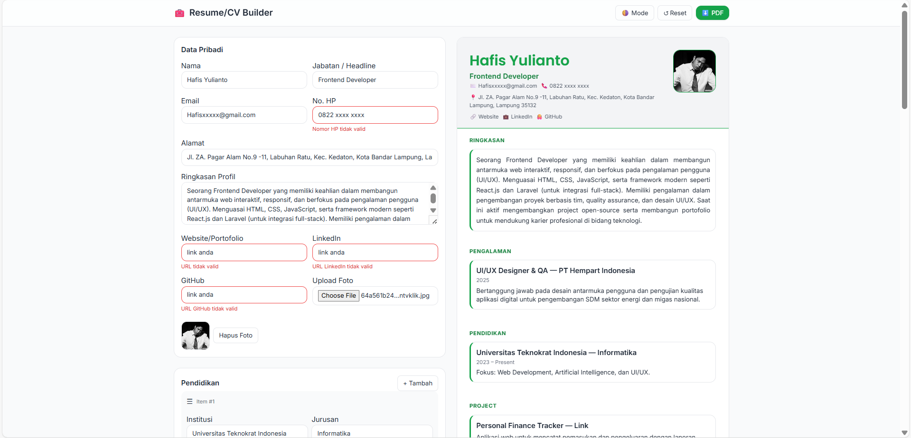

# Resume/CV Builder Online

Web app ringan untuk membuat CV secara cepat: isi form di kiri, lihat preview real‑time di kanan, pilih tema & template, lalu ekspor ke PDF. Data otomatis tersimpan di browser (localStorage).



## ✨ Fitur
- **Real‑time preview** saat mengisi form
- **Dua template**: Classic Professional & Modern Bubble
- **Tiga tema warna**: Biru, Hijau, Abu
- **Export PDF** via `html2pdf.js`
- **Persisten** dengan `localStorage`
- **Dark/Light mode** toggle
- **Dynamic sections**: Pendidikan, Pengalaman, Project, Skill (chips)
- **Share link** (opsional, data terenkode di URL)
- **QR Code** opsional untuk LinkedIn/GitHub di footer CV

## 🧱 Tech Stack
- **Frontend**: HTML5, TailwindCSS (CDN), Vanilla JavaScript
- **Library**: `html2pdf.js`, `qrcodejs`
- **Backend**: Tidak diperlukan (pure frontend). Opsional bisa ditambah Node/Express.

## 🚀 Cara Menjalankan (Lokal)
```bash
git clone <repo>
cd cv-builder
# cukup buka file
start index.html         # Windows
open index.html          # macOS
xdg-open index.html      # Linux
```

> Atau gunakan Live Server (VSCode) agar hot reload nyaman.

## 📦 Struktur Proyek
```
cv-builder/
├─ index.html       # UI utama (form + preview)
├─ style.css        # styling tambahan (tema, template, print)
├─ script.js        # logika aplikasi
└─ assets/
   └─ preview.png   # screenshot UI (tambahkan sendiri)
```

## 🛠️ Pengembangan & Kontribusi
- Pesan commit yang rapi:
  - `feat: add PDF export`
  - `ui: improve template spacing`
  - `fix: persist skills across reloads`
- Issues & PR dipersilakan.

## 🔒 Catatan Privasi
- Data CV **tidak** dikirim ke server, hanya disimpan di **localStorage**.
- Jangan menaruh data sensitif saat demo/publik.

## 📄 Lisensi
[MIT](./LICENSE)
